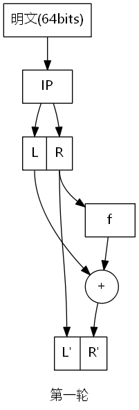
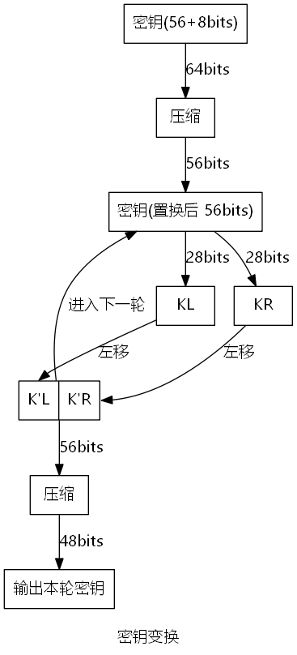
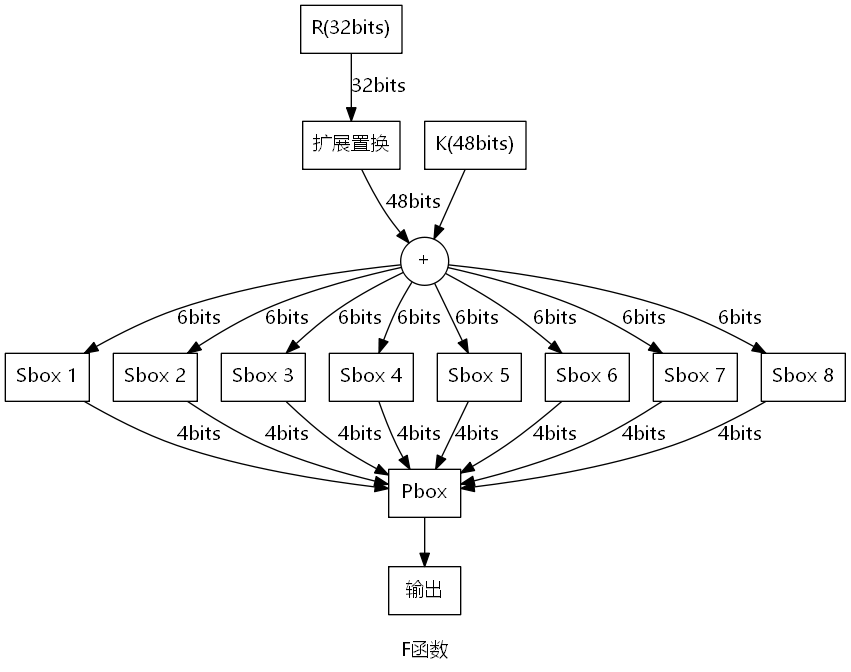

# DES 加密解密原理及算法

DES(Data Encryption Standard)，数据加密标准，是基于56位密钥的对称加密算法。算法为分块加密，进行16轮加密，使用64bits密钥（其中56bits有效位，8bits奇偶校验位）。解密核心原理为按位异或操作的可逆性，即：

$A \ \oplus \ B = C \Rightarrow A \ \oplus \ C = B$

1. 算法解析
    
    1. 骨架

    
    
    每一轮加密后的结果作为下一轮的输入，在第一轮之前进行$IP$置换，最后一轮之后进行$IP^{-1}$置换。

    2. 密钥变换

    
    
    密钥变换如图所示。64位密钥经过压缩置换变为56位有效密钥，分成LR两个部分进行移位。每一轮密钥变换的移位位数由移位表决定。结果有两方面作用：
        
        1. 经过第二次压缩置换，作为有效密钥进入本轮加密过程
        2. 返回到移位之前，作为下一轮密钥变换的输入

    加密全部过程中偏移总位数为28，与半密钥长度一致，因此在解密过程中只需反向偏移即可。

    3. F函数解析

    

    如图，f有两个输入，R(本轮加密过程中明文端的右半部分)，F(本轮密钥变换中的输出)。R进行一次扩展置换得到48bits，与K进行异或操作。结果为48bits。
    
    之后将48bits的结果分为8组，每组6bits分别放入8个S盒中，每个S盒得到4bits输出，拼成32bits。

    将32bits经过P盒置换得到32bits。此32bits作为输出进行加密过程的其他操作。

2. 算法描述

``` 
Algorithm: DES encryption
Input: 明文C(64bits), 密钥K(64bits)
Output: 密文P(64bits)

define M = C, T = K    # 作为加密过程中信息传递载体
M = IP(M), T = zip(T)  # 初始化处理
for i := 1 -> 16:
    T = left_shift (T, i)   # 左移为分组后左移，位数为预定义的移位表
    Key_to_use = zip2(T)    # 本轮加密所用有效密钥
    L' = R(M)               # M的右半部分直接置入新存储的左侧
    E = F(Key_to_use, R(M)) # F函数置换部分
    R' = L(M) XOR E
    M = L' <+> R'           # 拼凑为下一轮输入
    (end of for)
OUTPUT = IP^-1(M)      # 输出
```

``` 
Algorithm: F function
Input: K, R
Output: E

E = expand (R)   # 扩展置换
E = K XOR E
E' = S_box(E)    # 分组置入S盒，返回32bits
OUT = P_box(E')   # 将结果作为本轮有效密钥
```

与加密过程类似，解密过程使用的算法和加密大体相同，区别主要在于

    1. 明文将右半段移入新密文左侧，所以反过来，密文应将左半段移入新明文右侧
    2. 密钥变换时，先移位再置换使用，因此反过程应为先置换使用，再移位

```
Algorithm: DES decryption
Input: 密文P(64bits), 密钥K(64bits)
Output: 明文C(64bits)

define M = P, T = K    # 作为加密过程中信息传递载体
M = IP(M), T = zip(T)  # 初始化处理
for i := 16 -> 1:
    Key_to_use = zip2(T)      # 本轮加密所用有效密钥
    T = left_shift (T, i)   # 左移为分组后左移，位数为预定义的移位表
    R_origin = L(M)                 # M的右半部分直接置入新存储的左侧
    E = F(Key_to_use, R_origin)   # F函数置换部分,依据为异或操作的可逆性
    L_origin = R(M) XOR E
    M = L' <+> R'             # 拼凑为下一轮输入
    (end of for)
OUTPUT = IP^-1(M)      # 输出
```